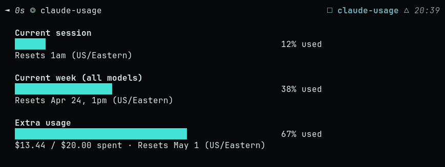

# claude-usage

A CLI that mirrors the `/usage` command in Claude Code, showing your Pro/Max plan usage limits in the terminal.



## Requirements

- Python 3.9+
- A Claude Pro or Max subscription
- Logged in via the Claude Code CLI (`claude`)

## Install

```bash
git clone https://github.com/creaked/claude-usage
chmod +x claude-usage/claude-usage
ln -s "$PWD/claude-usage/claude-usage" ~/.local/bin/claude-usage  # Linux
ln -s "$PWD/claude-usage/claude-usage" /usr/local/bin/claude-usage  # macOS
```

## Usage

```bash
claude-usage
```

Reads your OAuth token from `~/.claude/.credentials.json` (written by Claude Code) and calls the usage endpoint. No API key or extra config needed.

## How it works

Claude Code's `/usage` command fetches limits from an internal OAuth endpoint:

```
GET https://api.anthropic.com/api/oauth/usage
Authorization: Bearer <your OAuth token>
anthropic-beta: oauth-2025-04-20
```

This tool calls the same endpoint using the token Claude Code already stores locally. It was reverse-engineered from the Claude Code binary.

**No dependencies beyond Python stdlib.**

## Disclaimer

This uses an undocumented internal endpoint. It may break if Anthropic changes the API. Use at your own risk — this is not affiliated with or endorsed by Anthropic.
